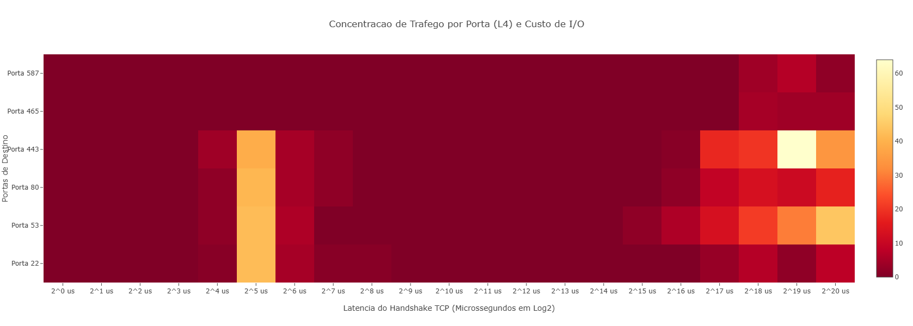

# Observabilidade de I/O de Rede: Heatmap de Latência TCP via eBPF


Este repositório contém uma ferramenta de observabilidade de baixa latência projetada para monitorar, estratificar e analisar o tempo de resposta do subsistema de rede do Kernel Linux. A aplicacao utiliza Kprobes via framework BCC (BPF Compiler Collection) para capturar o custo computacional de I/O na camada de Transporte (L4) e gerar matrizes multidimensionais de telemetria em tempo real.

---

## Contextualização do Problema

Tradicionalmente, a análise de performance e latência de rede baseia-se em ferramentas de espelhamento de trafego ou capturas de pacotes no espaco de usuario (como tcpdump e Wireshark). Embora eficazes para analise de protocolo, essas abordagens introduzem um overhead proibitivo em ambientes de produção devido a alocação de buffers (SKB).

Além disso, testes baseados em ICMP (como o comando ping) não refletem o comportamento real das aplicações, pois não passam pela pilha TCP/IP completa do sistema operacional. O desafio reside em mensurar o tempo exato que o Kernel Linux leva para processar e estabelecer conexões de rede, segregando esse tempo por porta de aplicação e sem degradar a vazão do servidor.

## A Aplicação

A solução desenvolvida propõe uma abordagem não intrusiva utilizando eBPF. Através de Kprobes, o código em C é injetado diretamente em pontos do subsistema de rede do Kernel, permitindo inspecionar e cronometrar eventos em nanossegundos no momento exato em que eles ocorrem.

Para mapear esses dados sem sobrecarregar a CPU, o programa agrupa os dados de telemetria diretamente na memória do Kernel utilizando uma estrutura de dados nativa do BPF chamada **BPF_HISTOGRAM**. Ao encerrar a coleta, o script extrai essa matriz tridimensional (Porta de Destino x Slot de Latencia em Log2 x Contagem de Conexoes) e renderiza um mapa de calor (Heatmap) em html.

---

## Pontos Chaves do Código eBPF

A arquitetura do projeto divide-se rigidamente entre a execução em espaço de núcleo e a agregação em espaço de usuário:

### Kernel-Space (Linguagem C)
* **Estrutura de Rastreamento (BPF_HASH):** Utiliza um mapa hash indexado pelo ponteiro da estrutura do socket (`struct sock *`) para armazenar o timestamp inicial de alta precisão no momento do disparo da conexão.
* **Kprobe tcp_v4_connect:** Intercepta o inicio do Handshake TCP (envio do pacote SYN), registrando o tempo inicial via `bpf_ktime_get_ns()`.
* **Kprobe tcp_rcv_state_process:** Intercepta a resposta da rede (recebimento do SYN-ACK). O código localiza o registro do socket, calcula o delta de tempo, converte o valor para microssegundos e calcula o indice logarítmico correspondente (`bpf_log2l`).
* **Inspeção de Estruturas Internas:** Extrai a porta de destino diretamente do socket TCP (`sk->__sk_common.skc_dport`) realizando a conversão de ordenação de bytes de rede para o host (`ntohs`).

### User-Space (Python)
* **Compilação Just-In-Time (JIT):** O framework BCC compila o codigo C em tempo de execução e injeta os ganchos de monitoramento no Kernel.
* **Extração Assíncrona:** O Python atua de forma assíncrona, exibindo visualizações preliminares em formato texto e, no encerramento, recuperando toda a matriz do eBPF Map para serialização em JSON.
* **Display Web:** Consolida os dados em uma pagina HTML independente que utiliza a biblioteca Plotly para construir gráficos de escala cromática quente, correlacionando o volume de tráfego à latência física.

---

## Como Executar

Para executar esta aplicação, é necessario utilizar um ambiente Linux com o Kernel compatível e as dependências do framework BCC instaladas:
```bash
# Atualize a lista de pacotes do sistema
sudo apt update

# Instale as dependências do Kernel, compiladores e o pacote Python do BCC
sudo apt install bpfcc-tools linux-headers-$(uname -r) python3-bpfcc
```


### 1. Execução do Script de Heatmap
Inicie o script principal do eBPF com privilegios de administrador para permitir a injecao das sondas no Kernel:
```bash
sudo python3 tcp_heatmap_relatorio.py
```

### 2. Execução do Script de Geração de Tráfego
Abra uma nova aba no terminal e execute o script gerador de tráfego para alimentar o Kernel com conexões simultâneas e geograficamente distribuídas:
```bash
python3 gerador_trafego.py
```
Aguarde até que o script exiba a mensagem informando que a geração de tráfego de rede foi concluída com sucesso.

### 3. Finalização e Visualização do Relatório
Retorne ao Terminal 1 e pressione `Ctrl + C` para interromper a captura de dados do Kernel. O script processará a estrutura acumulada na memória e gerará o arquivo HTML.

O arquivo `relatorio_heatmap.html` estará na raiz do projeto.

## Link para a Demonstração
O funcionamento da aplicação em tempo real foi registrada no link abaixo:
* [Video: Demonstração do Gráfico e Gerador de Tráfego]((https://youtu.be/yDieDcDArsU))


## Resultados e Explicacao
Abaixo esta a representação visual da matriz tridimensional extraída do Kernel Linux após a execução do programa:



Durante a execução do gerador de tráfego, foram geradas diversas conexões concorrentes para destinos locais e geograficamente distribuidos. O gráfico resultante apresenta uma distribuicao claramente bimodal, o que permite inferir alguns comportamentos sobre a infraestrutura:

### Interpretacao do Mapa de Calor
A matriz tridimensional gerada pelo script reflete as chamadas de rede realizadas durante o tráfego, evidenciando três comportamentos:

* **Aglomerado de Baixa Latência (Lado Esquerdo):** Concentrado especificamente entre os slots `2^4 us` e `2^6 us`, apresenta picos massivos (uma média de 40 conexoes simultaneas) exatamente no slot `2^5 us` (32 microssegundos) para as portas 22, 53, 80 e 443. Isso identifica perfeitamente o tráfego direcionado a interface de loopback (`127.0.0.1`). Notavelmente, as portas de e-mail (465 e 587) possuem zero ocorrencias nesta zona, comprovando que buscaram unicamente servidores externos.
* **Zona de Transição Vazia (Centro):** Observa-se uma ausência de registros na faixa de `2^8 us` (256 microssegundos) até `2^14 us` (16 milissegundos). Essa parte do gráfico comprova que o ambiente de teste não estabeleceu comunicação com servidores em uma rede local física (LAN), pulando diretamente das latências de barramento interno (loopback) para o overhead da internet pública.
* **Aglomerado de Alta Latência (Lado Direito):** O tráfego externo começa a se agrupar a partir de `2^16 us` (~65 milissegundos) e atinge concentrações máximas nos limites do gráfico. O log revela um pico de conexoes HTTPS (Porta 443) no slot `2^19 us` (~524 milissegundos, com 64 registros) e latências máximas de resolução DNS em TCP (Porta 53) no extremo `2^20 us` (~1 segundo). O tráfego SMTP (Portas 465 e 587) manifesta-se exclusivamente nesta zona direita, evidenciando o custo fisico do Handshake TCP com servidores de nuvem globais.


---
